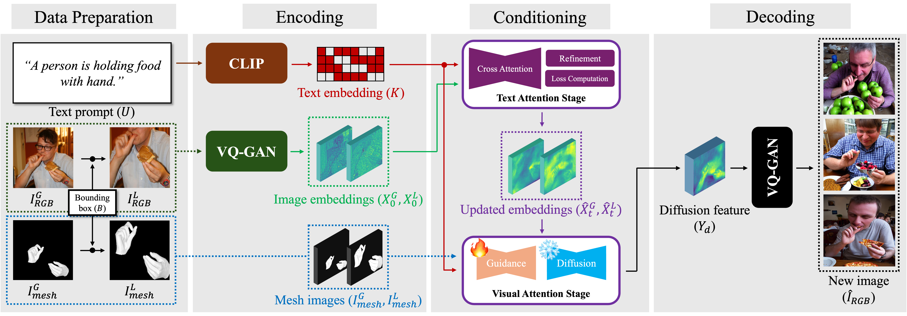

# [ECCV 2024 - Oral] AttentionHand: Text-driven Controllable Hand Image Generation for 3D Hand Reconstruction in the Wild
[](https://arxiv.org/abs/2407.18034)
[](https://redorangeyellowy.github.io/AttentionHand/)
[](https://www.youtube.com/watch?v=wfzY3LtFIxA) 

> **AttentionHand: Text-driven Controllable Hand Image Generation for 3D Hand Reconstruction in the Wild**
>
> [Junho Park*](https://www.linkedin.com/in/junho-park-461545270/), [Kyeongbo Kong*](https://scholar.google.com/citations?user=O9QSF7UAAAAJ&hl=ko&oi=ao) and [Suk-Ju Kang†](https://scholar.google.com/citations?user=3WYxpuYAAAAJ&hl=ko&oi=ao)
> 
> (\* Equal contribution, † Corresponding author)
>
> - Presented by Sogang University, LG Electronics, and Pusan National University
> - Primary contact: [Junho Park](https://www.linkedin.com/in/junho-park-461545270/) ( junho18.park@gmail.com ) 

## TL;DR

We propose **AttentionHand**, a novel method for text-driven controllable hand image generation. 
Our method needs easy-to-use four modalities (i.e, an RGB image, a hand mesh image from 3D label, a bounding
box, and a text prompt). 
These modalities are embedded into the latent space by the encoding phase. 
Then, through the text attention stage, hand-related tokens from the given text prompt are attended to highlight hand-related regions of the latent embedding. 
After the highlighted embedding is fed to the visual attention stage, hand-related regions in the embedding are attended by conditioning global and local hand mesh images with the diffusion-based pipeline. 
In the decoding phase, the final feature is decoded to new hand images, which are well-aligned with the given hand mesh image and text prompt.



## What's New<a name="news"></a>

[2024/11/22] :star: We release train & inference code! Enjoy! :smile: 

[2024/08/12] :rocket: Our paper will be introduced as **oral presentation** at ECCV 2024!

[2024/07/03] :fire: Our paper is accepted by ECCV 2024!

## Install
```
pip install -r requirements.txt
```


## Inference

1. ~~Download our pre-trained model `attentionhand.ckpt` from [here](https://drive.google.com/drive/folders/1YC-eaTPW5ZtkWQe3y5XXw1-jndmQ-NlO?usp=drive_link).~~ I will update the checkpoint ASAP. Alternatively, you can train from the scratch on your own as described in [here](https://github.com/redorangeyellowy/AttentionHand?tab=readme-ov-file#train-from-scratch).
3. Set your own modalities in `samples`. (But, we provide some samples for fast implementation.)
4. Put samples and downloaded weight as follows.
```
${ROOT}
|-- samples
|   |-- mesh
|   |   |-- ...
|   |-- text
|   |   |-- ...
|   |-- modalities.json
|-- weights
|   |-- attentionhand.ckpt
```
4. Run `inference.py`.

## Train from scratch

1. Download initial model `sd15_ini.ckpt` from [here](https://drive.google.com/drive/folders/1YC-eaTPW5ZtkWQe3y5XXw1-jndmQ-NlO?usp=drive_link).
2. Download pre-processed dataset `dataset.tar.gz` from [here](https://drive.google.com/drive/folders/1YC-eaTPW5ZtkWQe3y5XXw1-jndmQ-NlO?usp=drive_link).
3. Put downloaded weight and dataset as follows.
```
${ROOT}
|-- data
|   |-- mesh
|   |   |-- ...
|   |-- rgb
|   |   |-- ...
|   |-- text
|   |   |-- ...
|   |-- modalities.json
|-- weights
|   |-- sd15_ini.ckpt
```
4. Run `train.py`.

## Fine-tuning

1. ~~Download our pre-trained model `attentionhand.ckpt` from [here](https://drive.google.com/drive/folders/1YC-eaTPW5ZtkWQe3y5XXw1-jndmQ-NlO?usp=drive_link).~~ I will update the checkpoint ASAP. Alternatively, you can train from the scratch on your own as described in [here](https://github.com/redorangeyellowy/AttentionHand?tab=readme-ov-file#train-from-scratch).
2. Set your own modalities in `data` as `datasets.tar.gz` in [here](https://drive.google.com/drive/folders/1YC-eaTPW5ZtkWQe3y5XXw1-jndmQ-NlO?usp=drive_link).
3. Put downloaded weight and dataset as follows.
```
${ROOT}
|-- data
|   |-- mesh
|   |   |-- ...
|   |-- rgb
|   |   |-- ...
|   |-- text
|   |   |-- ...
|   |-- modalities.json
|-- weights
|   |-- attentionhand.ckpt
```
4. Change `resume_path` in `train.py` to `weights/attentionhand.ckpt`.
5. Run `train.py`.

## Related Repositories

Special thank to the great project: [ControlNet](https://github.com/lllyasviel/ControlNet) and [Attend-and-Excite](https://github.com/yuval-alaluf/Attend-and-Excite)!

## License and Citation <a name="license-and-citation"></a>

All assets and code are under the [license](./LICENSE) unless specified otherwise.

If this work is helpful for your research, please consider citing the following BibTeX entry.

``` bibtex
@article{park2024attentionhand,
  author  = {Park, Junho and Kong, Kyeongbo and Kang, Suk-Ju},
  title   = {AttentionHand: Text-driven Controllable Hand Image Generation for 3D Hand Reconstruction in the Wild},
  journal = {European Conference on Computer Vision},
  year    = {2024},
}
```
